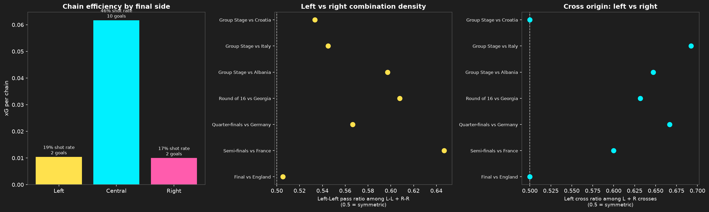

<!--
블로그 발행용 초안입니다. 저장소 안의 RESULTS.md들(구조는 사실/근거 문서, 이 파일은 발행용 정리본)을
종합해 정리했습니다. 발행 전 확인할 것:
1. 이미지가 전부 상대 경로(./pass_network/processed/...)를 가리킵니다 — 저장소 밖(블로그)에서는
   깨지므로, 발행 플랫폼에 이미지를 직접 업로드하고 경로를 교체하세요.
2. 문체는 정리/설명체입니다 — 블로그 톤에 맞게 다듬어도 됩니다.
-->

# 2024 유로 스페인은 왜 항상 왼쪽으로 공격했을까 — 7경기 데이터로 본 빌드업 스타일

2024 UEFA 유로에서 우승한 스페인은 "센터백을 넓게 벌리고 로드리가 후방을 지휘하며, 좌우 풀백이 윙까지 전진한다"는 뚜렷한 빌드업 스타일로 평가받았습니다. 그런데 정말로 좌우가 대칭이었을까요? 아니면 어느 한쪽을 더 선호했을까요?

StatsBomb 오픈 데이터(이벤트 좌표 포함)로 스페인이 치른 7경기(조별리그 3 + 토너먼트 4) 전체를 뜯어봤습니다. 패스 네트워크, 구역별 전진 경로, 통계 검정, possession 체인 추적, 그리고 "왜 왼쪽이었는가"까지 다섯 가지 방법으로 같은 질문을 다른 각도에서 확인했고, 결론은 처음 예상과도, 도중에 세운 가설과도 달랐습니다.

## 결론부터

> **대형(누가 어디에 서는가)은 좌우가 거의 대칭이었지만, 실제로 볼이 전진하는 목적지는 통계적으로 유의미하게(p < 0.05) 왼쪽으로 쏠려 있었습니다. 그 쏠림은 선수들의 볼 관여도 단계(53.5%)에서는 미세했지만, 최종적으로 볼이 도달하는 구역(56.9~59.7%)에서는 훨씬 크게 증폭됐고, 왼쪽으로 향하는 빌드업은 오른쪽보다 더 많은 패스를 거쳐 조립됐습니다. 그런데 이 쏠림은 "왼쪽이 골을 더 잘 만들어서"가 아니었습니다 — 슈팅·득점·어시스트 효율은 좌우가 비슷했고 오히려 중앙이 압도적으로 효율적이었습니다. 대신 왼쪽 포지션 조합(풀백-센터백-수비형 미드필더-윙어)이 오른쪽보다 통계적으로 유의미하게 더 자주 호흡을 맞췄고, 크로스도 왼쪽에서 유의미하게 더 많이 올라왔다는 것이, 데이터가 뒷받침하는 가장 설득력 있는 이유였습니다 — 다만 그 많은 크로스가 골로 이어지는 비율 자체는 오른쪽과 다르지 않았습니다.**

아래에서 이 결론에 어떻게 도달했는지, 다섯 가지 방법론을 하나씩 따라가 보겠습니다.

## 1. 패스 네트워크로 본 "구조" — 눈으로 보면 완벽한 대칭

먼저 선수들이 경기 내내 어디에 서서 누구와 연결됐는지를 봤습니다. 교체 선수가 들어와도 같은 포지션 슬롯(예: "왼쪽 수비형 미드필더")을 물려받는 것으로 처리해, 경기 전체를 하나의 네트워크로 합산했습니다.

7경기 내내 반복된 구조는 이랬습니다.

- **센터백 듀오가 넓게 벌려 선다** — 라포르테-르 노르망이 가장 흔했지만, 로테이션으로 나초·비비안이 들어와도 "넓게 벌리는" 대형 자체는 그대로였습니다.
- **로드리(또는 대체 선수)가 후방 전개를 전담한다** — 로드리가 빠져도 그 자리는 항상 팀에서 패스가 가장 많이 몰리는 허브였습니다.
- **풀백이 윙 포지션까지 전진한다** — 사실상 윙백처럼 뛰며 같은 쪽 윙어와 강하게 연결됩니다.
- **윙어는 터치라인을 지킨다** — 중앙은 로드리·파비안 루이스·다니 올모 계열이 채우는 구조.

특정 선수 조합이 아니라 **시스템 자체**가 스페인 정체성의 핵심이었다는 뜻입니다. 유일하게 구조가 흔들린 경기는 준결승 프랑스전으로, 나바스 교체 이후 나초가 센터백에서 라이트백으로 재배치되며 백4에서 백3/5 계열로 넘어간 것으로 보였습니다.

여기까지만 보면 "좌우 대칭적으로 폭을 쓰는 팀"이라는 인상을 받습니다. 실제로도 육안으로는 그렇습니다.

## 2. 구역 기반 전진 경로로 본 "방향" — 그런데 목적지는 왼쪽

패스 네트워크가 "누가 어디 있었는가"를 보여준다면, 이번엔 "볼이 실제로 어디로 향했는가"를 봤습니다. 피치를 30개 구역(코칭 현장에서 쓰는 Juego de Posición 표준 그리드)으로 나눠, 구역별 패스 점유와 전진 방향을 겹쳐 그렸습니다.

결과는 뚜렷했습니다. **`Att-Mid/Left Wide`(하프라인을 갓 넘긴 왼쪽 와이드 구역)가 7경기 전부에서 점유 상위 3위 안에 들었고, 4경기에서는 1~2위를 차지했습니다.** 패스 네트워크만 봐서는 절대 드러나지 않는 비대칭입니다. 대형은 대칭이지만, 그 대형을 통해 볼을 전진시킬 때는 오른쪽(라민 야말 쪽)보다 왼쪽(니코 윌리엄스·쿠쿠레야/발데 쪽)을 일관되게 더 많이 활용한 겁니다.

가장 극단적인 경기는 준결승 프랑스전으로, `Att-Mid/Left Wide` 점유가 2위 구역보다 2배 이상 많았습니다 — 공교롭게도 대형 자체가 유일하게 흔들린 바로 그 경기입니다.

## 3. 통계로 검증하기 — "거의 대칭"은 사실 완벽한 대칭이 아니었다

7장의 이미지를 눈으로 비교하는 건 인상 비평에 가깝습니다. 그래서 매치별로 "왼쪽 비율"(왼쪽 / (왼쪽+오른쪽))을 계산해, 완전 대칭(0.5)과 통계적으로 다른지 검정했습니다(paired t-test, 표본 7개).

| 지표 | 평균 왼쪽 비율 | p-value |
| :--- | ---: | ---: |
| 구역 점유(전체 구역) | 56.9% | 0.0059 |
| 구역 점유(`Att-Mid`만) | 59.7% | 0.0370 |
| 패스 네트워크(선수 관여도) | 53.5% | 0.0315 |

**세 지표 모두 통계적으로 유의미하게 왼쪽으로 치우쳐 있었습니다.** 여기서 가장 흥미로운 지점은 패스 네트워크입니다. 눈으로는 "완벽히 대칭"으로 보였지만, 실제로는 53.5%로 대칭(50%)을 유의미하게 벗어나 있었습니다 — 미세하지만 분명히 존재하는 쏠림입니다.

더 흥미로운 건 이 쏠림의 "증폭" 패턴입니다. 선수 관여도 단계에서는 53.5%였던 쏠림이, 볼이 실제로 도달하는 최종 구역에서는 56.9~59.7%까지 커집니다. **작은 구조적 편향이 빌드업이 진행될수록 점점 더 크게 벌어지는 셈**입니다.

## 4. Possession 체인으로 본 "왼쪽 진출의 비용"

마지막으로, 개별 패스가 아니라 "같은 소유권(possession) 안에서 이어진 연속 패스" 단위로 빌드업을 추적했습니다. 왼쪽으로 끝난 체인과 오른쪽으로 끝난 체인의 길이(패스 수)를 비교했습니다.

| 경기 | 왼쪽 체인 중앙값 패스 수 | 오른쪽 체인 중앙값 패스 수 |
| :--- | ---: | ---: |
| 조별리그 크로아티아 | 5.0 | 4.0 |
| 조별리그 이탈리아 | 7.0 | 6.0 |
| 조별리그 알바니아 | 8.0 | 6.0 |
| 16강 조지아 | 11.0 | 14.5 (예외) |
| 8강 독일 | 5.0 | 4.5 |
| 준결승 프랑스 | 6.0 | 4.5 |
| 결승 잉글랜드 | 8.0 | 6.0 |

**7경기 중 6경기에서 왼쪽으로 끝난 체인이 오른쪽보다 더 많은 패스를 거쳤습니다.** 즉 왼쪽 진출은 단순히 "더 자주 시도된다"가 아니라, "더 여러 번의 패스를 거쳐 정교하게 조립된다"는 뜻입니다. 유일한 예외인 16강 조지아전은 스페인이 4-1로 압도한 경기로, 오른쪽에서 51패스짜리 특이하게 긴 순환 하나가 평균을 끌어올린 결과였습니다.

## 5. 그렇다면 왜 왼쪽이었을까 — 가설 세 개를 검증하다

여기까지는 "왼쪽으로 쏠렸다"는 **사실**만 확인한 겁니다. 진짜 궁금한 건 "왜"였습니다. 그럴듯한 가설 세 개를 세우고 직접 검증했습니다.

- **가설 1 (득점 효율)**: 왼쪽으로 향한 빌드업이 슈팅·골로 더 잘 이어졌을 것이다.
- **가설 2 (선수 조합)**: 왼쪽 포지션을 맡은 선수들이 서로 더 자주 호흡을 맞췄을 것이다.
- **가설 3 (크로스/어시스트)**: 왼쪽에서 컷백·크로스가 더 자주 올라와 어시스트로 이어졌을 것이다.

`possession` 단위로 정의한 체인이 같은 소유권 안에서 슈팅으로 이어졌는지 연결해봤습니다.

| 체인 최종 도착 구역 | 슈팅 전환율 | 체인당 xG | 골 수(7경기 합산) |
| :--- | ---: | ---: | ---: |
| 왼쪽 | 18.8% | 0.0104 | 2 |
| **중앙** | **46.5%** | **0.0617** | **10** |
| 오른쪽 | 17.2% | 0.0100 | 2 |

**가설 1은 틀렸습니다.** 왼쪽(18.8%)과 오른쪽(17.2%) 체인의 슈팅 전환율·xG는 사실상 비슷했습니다. 오히려 압도적으로 효율적인 건 중앙으로 끝난 체인이었습니다 — 슈팅 전환율이 왼쪽의 2.5배, 체인당 xG는 6배에 달했고, 7경기 골 14개 중 10개가 중앙 체인에서 나왔습니다. 생각해보면 당연합니다 — 슈팅은 대부분 박스 중앙 근처에서 나오니까요. 왼쪽으로 많이 전진했다고 해서 골이 더 잘 나온 건 아니었습니다.

그럼 가설 2는 어떨까요. 패스 네트워크의 포지션 슬롯 쌍을 왼쪽끼리(레프트백↔왼쪽 센터백↔왼쪽 수비형 미드필더↔레프트윙, L-L)와 오른쪽끼리(R-R)로 나눠 패스 수를 비교했습니다.

| | 7경기 합산 패스 수 | 매치별 비율 평균 | 통계 검정 |
| :--- | ---: | ---: | :--- |
| 왼쪽끼리(L-L) | 840 | **57.2%** | paired t-test, **p = 0.0080** |
| 오른쪽끼리(R-R) | 621 | 42.8% | (7경기 전부 왼쪽 우세) |

**가설 2는 데이터로 뒷받침됐습니다.** 왼쪽 포지션군이 오른쪽보다 유의미하게 더 자주 서로 연결됐고, 이 크기(57.2%)는 앞서 확인한 구역 점유 쏠림(56.9%)과 거의 일치합니다. 즉 "왼쪽이 더 위력적이어서"가 아니라, **"왼쪽 조합을 더 자주, 더 많이 활용했기 때문에" 왼쪽 구역 점유가 결과적으로 쌓인 것**으로 보는 게 데이터와 더 잘 맞습니다. 결승전 기준으로는 쿠쿠레야/발데(LB)-라포르테(LCB)-로드리/파비안 루이스(LDM)-니코 윌리엄스(LW)로 이어지는 왼쪽 축이, 카르바할(RB)-르 노르망(RCB)-야말(RW)로 이어지는 오른쪽 축보다 더 촘촘하게 짜여 있었다는 뜻입니다.

마지막으로 가설 3입니다. StatsBomb은 골로 직결된 패스(`pass_goal_assist`), 슈팅으로 직결된 패스(`pass_shot_assist`), 크로스(`pass_cross`)를 각각 플래그로 표시해줍니다. 이 패스들이 시작된 위치를 왼쪽/중앙/오른쪽으로 나눠봤습니다.

| 유형 (7경기 합산) | 왼쪽 | 오른쪽 | 통계 검정 |
| :--- | ---: | ---: | :--- |
| 골 어시스트 (n=12) | 4 | 5 | 표본이 작아 검정 생략 |
| 슈팅 어시스트 (n=96) | 40 | 33 | 평균 53.9%, **p = 0.6458 (유의하지 않음)** |
| **크로스 (n=89)** | **55** | 34 | 평균 60.5%, **p = 0.0114 (유의함)** |

**가설 3은 절반만 맞았습니다.** 크로스는 확실히 왼쪽에서 더 많이 올라왔습니다(60.5%, 7경기 중 6경기에서 왼쪽 우세) — 앞서 확인한 선수 조합 밀도와 정확히 같은 방향입니다. 그런데 그게 실제 득점 기여로는 이어지지 않았습니다. 골 어시스트는 오히려 오른쪽이 근소하게 많았고(비록 표본 12개로 단정하긴 어렵지만), 슈팅 어시스트의 왼쪽 비율(53.9%)도 통계적으로 유의미하지 않았습니다. **왼쪽에서 공은 더 많이 올라왔지만, 그 공이 골로 이어지는 비율은 오른쪽과 다르지 않았다는 뜻**입니다 — 가설 1(득점 효율)의 결론과도 정확히 맞아떨어집니다.

## 종합하면

다섯 가지 방법론을 겹쳐 보면 하나의 일관된 그림이 보입니다.

1. **대형은 좌우 대칭에 가깝다** — 하지만 완벽하지는 않다(53.5%, 통계적으로 유의).
2. **볼의 실제 목적지는 왼쪽으로 뚜렷하게 쏠린다**(56.9~59.7%) — 관여도 단계보다 훨씬 크게 증폭된다.
3. **왼쪽으로 가는 길은 더 길고 정교하다** — 더 많은 패스를 거쳐 조립된다.
4. **그 이유는 득점 효율이 아니라 활용 빈도다** — 좌우 슈팅·어시스트 효율은 비슷했고(중앙이 압도적), 왼쪽 포지션군의 연결과 크로스가 통계적으로 유의미하게 더 자주 나왔다.
5. 이 패턴은 상대나 경기 중요도와 무관하게 조별리그부터 결승까지 일관되게 유지됐다.

패스 네트워크만 봤다면 "좌우 폭을 대칭적으로 쓰는 팀"이라는 결론에 그쳤을 겁니다. 여러 방법론을 겹쳐 보고서야 "대형은 대칭이지만, 왼쪽 조합을 더 자주 활용한 탓에 실제 전진은 왼쪽에 쏠렸고, 그 쏠림이 단계를 거치며 증폭되는 팀"이라는 훨씬 구체적인 그림을 얻을 수 있었습니다.

## 한계

- 통계 검정은 표본이 매치 7개뿐이라 paired t-test의 정규성 가정을 엄밀하게 만족한다고 보기는 어렵습니다. p-value는 참고용으로, 평균 비율(효과 크기)과 함께 해석하는 게 안전합니다.
- 패스 네트워크의 "구조 유지" 판단은 대부분 7장의 이미지를 정성적으로 비교한 관찰이며, 통계 검정은 그중 좌우 비율 하나에만 적용했습니다.
- possession 체인의 "대표 체인"은 각 경기에서 가장 긴 체인 하나를 뽑은 사례일 뿐, 그 경기의 "전형적인" 경로를 뜻하지는 않습니다.
- "왼쪽 조합이 왜 더 자주 활용됐는가"(클럽 레벨에서 쌓인 호흡, 감독의 전술 지시, 상대 수비 배치에 대한 대응 등) 자체는 이벤트 데이터만으로는 인과적으로 증명할 수 없습니다 — 여기서 확인한 건 "더 자주 연결됐다"는 상관관계이지, 왜 그런 선택을 했는지에 대한 설명은 아닙니다.
- 골 어시스트 표본은 7경기 합산 12개뿐이라 통계 검정 없이 원시 개수만 참고용으로 봤습니다.

---

*데이터: [StatsBomb Open Data](https://github.com/statsbomb/open-data) (UEFA Euro 2024, competition_id=55/season_id=282). 분석 코드와 상세 방법론은 [GitHub 저장소](https://github.com/taijong915/football_analysis)의 `spain_euro2024/` 폴더에 공개되어 있습니다.*
