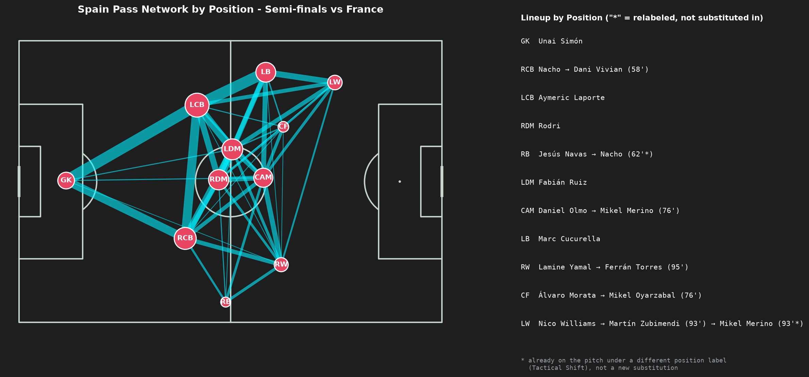
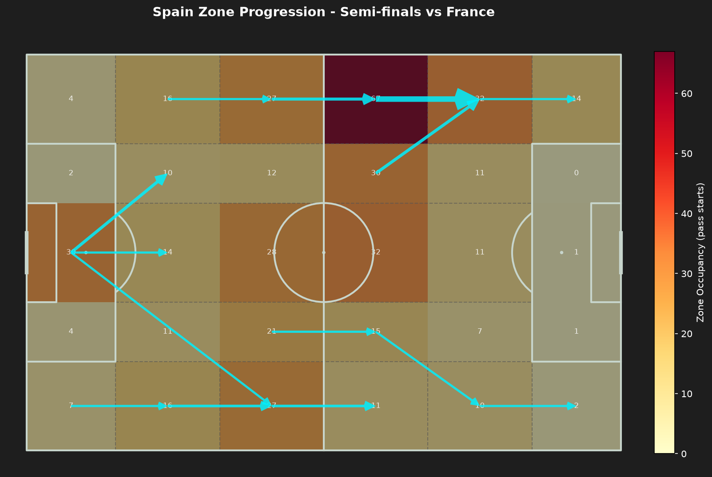

# 종합 결과: 2024 유로 스페인의 빌드업 패턴

[`PLAN.md`](./PLAN.md)의 분석 질문 4("위 결과를 종합했을 때, 대회 전체를 관통하는 스페인의 빌드업 스타일을 한두 문장으로 어떻게 요약할 수 있는가?")에 대한 최종 결론입니다. 두 방법론 각각의 상세 결과는 [`pass_network/RESULTS.md`](./pass_network/RESULTS.md)(패스 네트워크)와 [`zone_progression/RESULTS.md`](./zone_progression/RESULTS.md)(구역 기반 전진 경로)를 참고하세요.

| 패스 네트워크 (구조) | 구역 기반 전진 경로 (방향) |
| :--- | :--- |
|  |  |

## 결론

**센터백을 넓게 벌리고 로드리(대체 선수 포함)가 축이 되는 중앙 순환 구조로 빌드업을 시작해, 풀백을 윙 포지션까지 전진시켜 폭을 만들되, 실제 전진의 종착점은 대체로 왼쪽으로 쏠렸다.**

패스 네트워크와 구역 기반 전진 경로는 서로 다른 걸 보여줍니다 — 패스 네트워크는 "누가 어디에 서 있었는가"(구조), 구역 기반 전진 경로는 "볼이 실제로 어디로 몰렸는가"(방향과 목적지)입니다. 7경기 전체에서 둘을 겹쳐 보면 위와 같이 요약됩니다.

- **구조(패스 네트워크)**: 센터백 듀오가 넓게 벌리고 로드리(또는 대체 선수)가 후방 전개를 전담하며, 좌우 풀백이 모두 윙 포지션까지 전진하는 대형이 스쿼드 로테이션·경기 중요도와 무관하게 7경기 내내 유지됐습니다. 이 구조만 보면 좌우 대칭적입니다 — LB/RB 모두 하프라인 위쪽까지 올라와 같은 쪽 윙어와 연결됐습니다.
- **방향(구역 기반 전진 경로)**: 그런데 점유 히트맵 상위 구역을 보면 `Att-Mid/Left Wide`(하프라인을 갓 넘긴 왼쪽 와이드)가 7경기 전부에서 상위 3위, 4경기에서 1~2위를 차지했습니다 — 패스 네트워크의 "좌우 대칭 구조"만으로는 드러나지 않는 비대칭입니다. 즉 구조는 좌우 대칭이었지만, 그 구조를 통해 볼을 전진시킬 때는 오른쪽(야말 쪽)보다 왼쪽(니코 윌리엄스·쿠쿠레야/발데 쪽)을 일관되게 더 많이 활용했습니다.
- **두 방법론을 합쳐야 보이는 그림**: 패스 네트워크만 봤다면 "좌우 폭을 대칭적으로 쓰는 팀"이라는 결론에 그쳤을 것입니다. 구역 기반 전진 경로를 더하고 나서야 "구조는 대칭이지만 실제 전진 루트는 왼쪽에 쏠린 팀"이라는, 더 구체적이고 방향성 있는 결론을 낼 수 있었습니다 — 이것이 애초에 이 주제를 두 방법론으로 나눠 진행한 이유(분석 질문 1과 3)와 맞아떨어집니다.
- **일관성과 예외**: 이 패턴은 조별리그부터 결승까지 상대·경기 중요도와 무관하게 유지됐습니다(분석 질문 2). 유일한 예외적 강도 차이는 프랑스전(왼쪽 편중이 가장 극단적, 2위 구역과 2배 이상 차이)과 결승전(중앙보다 왼쪽이 근소하게 우세한 유일한 경기)이었습니다 — 둘 다 "왼쪽 우선"이라는 큰 틀 안에서의 강도 차이일 뿐, 구조 자체가 바뀐 경우와는 별개입니다.

### 예외 사례: 준결승 프랑스전

프랑스전은 구조와 방향 양쪽 모두에서 7경기 중 가장 튀는 경기였습니다 — 아래 두 이미지가 같은 경기를 각각 "구조"와 "방향" 관점에서 보여줍니다.

| 패스 네트워크 (구조) | 구역 기반 전진 경로 (방향) |
| :--- | :--- |
|  |  |

- **구조**: 57분 헤수스 나바스 교체 이후 나초가 RCB에서 RB로 재배치되며 백4에서 백3/5 계열로 넘어간 것으로 보이는, 7경기 중 유일하게 구조 자체가 바뀐 경기입니다([`pass_network/RESULTS.md`](./pass_network/RESULTS.md) 참고).
- **방향**: 동시에 `Att-Mid/Left Wide` 구역 점유가 67로 2위 구역(32)과 2배 이상 차이 나는, 왼쪽 편중이 가장 극단적인 경기이기도 합니다([`zone_progression/RESULTS.md`](./zone_progression/RESULTS.md) 참고). 구조가 대회 중 유일하게 흔들린 경기에서도 "왼쪽으로의 전진"이라는 방향성만큼은 오히려 더 강해졌다는 점이 흥미롭습니다.

## 한계

- 두 방법론 각각의 한계는 [`pass_network/RESULTS.md`](./pass_network/RESULTS.md)와 [`zone_progression/RESULTS.md`](./zone_progression/RESULTS.md)의 "한계" 절을 참고하세요.
- 이 결론은 두 방법론의 결과를 정성적으로 겹쳐 본 것으로, "구조는 대칭인데 방향은 비대칭"이라는 관찰을 통계적으로 검정한 것은 아닙니다.
