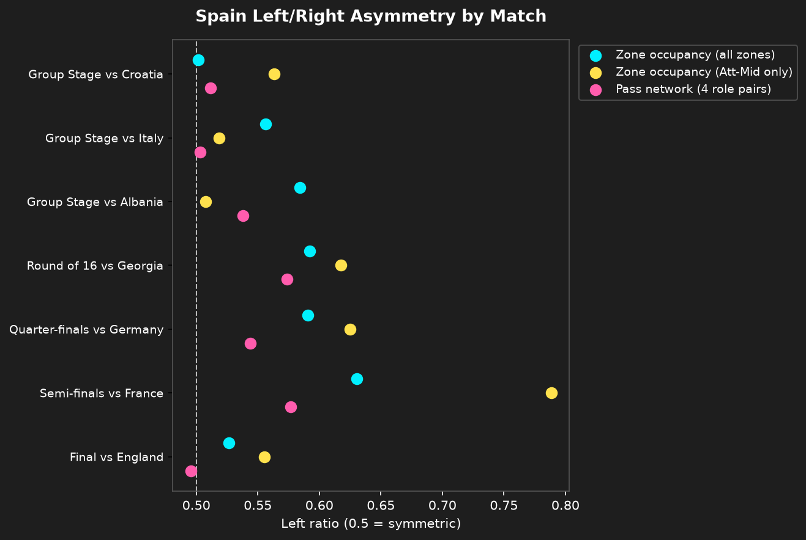

# 좌우 비대칭 통계 검증 결과: 2024 유로 스페인 빌드업 패턴

`../PLAN.md`의 분석 질문 5("패스 네트워크의 '구조 유지' 판단과 구역 기반 전진 경로의 '왼쪽 쏠림'을 수치·통계적으로 검증하면 어떤 결과가 나오는가")에 대한 종합 결과입니다. 방법론은 [`07_spain_euro2024_asymmetry_stats.ipynb`](./07_spain_euro2024_asymmetry_stats.ipynb)의 "방법론" 셀을, 원본 이미지는 [`processed/spain_euro2024_asymmetry_stats.png`](./processed/spain_euro2024_asymmetry_stats.png)를 참고하세요.

## 세 지표 모두 왼쪽 쏠림이 통계적으로 유의미하다 - 다만 크기는 다르다

7경기를 표본으로, 매치별 "왼쪽 비율"(왼쪽 / (왼쪽+오른쪽))이 완전 대칭(0.5)과 다른지 paired t-test(`scipy.stats.ttest_1samp`, mu=0.5)로 검정했습니다.

| 지표 | 평균 왼쪽 비율 | 표준편차 | t(6) | p-value |
| :--- | ---: | ---: | ---: | ---: |
| 구역 점유(전체 구역) | **0.569** | 0.044 | 4.163 | **0.0059** |
| 구역 점유(Att-Mid만) | **0.597** | 0.096 | 2.670 | **0.0370** |
| 패스 네트워크(4개 역할군) | **0.535** | 0.033 | 2.792 | **0.0315** |

**세 지표 모두 유의수준 0.05에서 통계적으로 유의미하게 왼쪽으로 치우쳐 있습니다.** 즉 "왼쪽 쏠림"은 7장 이미지를 눈으로 비교한 인상이 아니라 수치로도 확인되는 패턴입니다.

동시에 **효과 크기는 세 지표가 뚜렷하게 다릅니다.** 패스 네트워크(선수가 볼을 얼마나 자주 만지는지, 즉 관여도)의 왼쪽 비율은 평균 0.535로 대칭(0.5)에 가깝고 표준편차도 가장 작습니다(0.033) - 통계적으로는 유의하지만 실질적인 쏠림은 작습니다. 반면 구역 점유(전체)는 0.569, 실제 왼쪽 쏠림이 관찰된 `Att-Mid` 구역만 보면 0.597까지 올라갑니다. 이는 기존 정성적 결론("구조는 대칭, 실제 진출 방향만 비대칭")을 다음과 같이 더 정확하게 수정합니다.

> **선수 관여도(패스 네트워크) 수준에서는 왼쪽으로의 쏠림이 통계적으로는 존재하지만 크기가 작다(53.5%대46.5%에 가까움). 이 작은 구조적 쏠림이, 볼이 실제로 도달하는 최종 구역(특히 `Att-Mid/Left Wide`)에서는 훨씬 크게 증폭된다(59.7%대40.3%). 즉 "패스 네트워크는 완전 대칭"이라는 이전 결론은 엄밀히는 틀렸다 - 미세하지만 유의미하게 왼쪽으로 기울어 있었고, 그 작은 기울기가 최종 전진 단계에서 크게 벌어진다.**

## 경기별로 본 패턴

산점도(위 이미지)에서 각 매치의 세 지표를 나란히 보면, 거의 모든 경기에서 핑크(패스 네트워크) 점이 0.5에 가장 가깝고, 시안(구역 전체)·노랑(Att-Mid) 순으로 오른쪽(왼쪽 쏠림 방향)으로 벌어지는 "계단식" 순서가 반복됩니다. 유일한 예외는 크로아티아전(대회 첫 경기)으로, 구역 점유(전체)가 0.502로 거의 완전 대칭에 가까웠습니다 - 대회 초반에는 아직 왼쪽 편중이 자리잡기 전이었을 가능성과 일치합니다([`../zone_progression/RESULTS.md`](../zone_progression/RESULTS.md)의 "균형 잡힌 버전" 관찰 참고).

프랑스전은 `Att-Mid` 왼쪽 비율이 0.789로 7경기 중 가장 극단적이었는데, 이는 이미 `zone_progression/RESULTS.md`에서 "`Att-Mid/Left Wide`가 단독 압도적 1위" 경기로 확인된 결과와 일치합니다. 이 극단값이 `Att-Mid`만 기준의 표준편차(0.096, 다른 두 지표보다 2~3배 큼)를 끌어올려 p-value도 세 지표 중 가장 큽니다(0.037) - 표본이 매치 7개뿐이라 극단값 하나의 영향력이 크다는 뜻이기도 합니다.

## 한계

- 표본이 매치 7개뿐이라 paired t-test의 정규성 가정을 엄밀히 검증하기 어렵습니다. p-value는 참고용으로, 평균 비율(효과 크기)과 함께 해석해야 합니다.
- 패스 네트워크 지표는 7경기 전부에 공통으로 존재하는 4개 역할군(Back/Center Back/Defensive Midfield/Wing)만 사용합니다 - 조지아·프랑스전의 Center Midfield, 독일전(연장)의 Center Forward/Midfield처럼 일부 경기에만 등장하는 포지션은 좌우 비교의 공정성을 위해 제외했습니다.
- 이 문서는 좌우 비대칭 통계 검증 관점의 결론만 다룹니다. 패스 네트워크·구역 기반 전진 경로·possession 체인 추적과 종합한 최종 "스페인 빌드업 스타일" 결론은 상위 [`../PLAN.md`](../PLAN.md)/[`../RESULTS.md`](../RESULTS.md)를 참고하세요.
