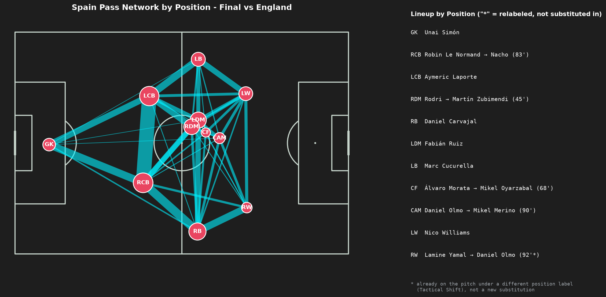

# 패스 네트워크 결과: 2024 유로 스페인 빌드업 패턴

`../PLAN.md`의 분석 질문에 대한 패스 네트워크 부분의 종합 결과입니다. 방법론은 [`04_spain_euro2024_buildup.ipynb`](./04_spain_euro2024_buildup.ipynb)의 "방법론" 셀, 7경기 원본 이미지는 [`processed/spain_euro2024_pass_networks/`](./processed/spain_euro2024_pass_networks/)를 참고하세요.

## 대회 전체를 관통하는 구조 (분석 질문 1, 4)

7경기 전체에서 아래 구조가 반복해서 나타났습니다 — 상대, 경기 중요도, 심지어 선발 명단이 통째로 바뀐 경기에서도 무너지지 않았습니다.

- **센터백 듀오가 넓게 벌려 선다**: 두 센터백이 좌우로 크게 벌어져 골키퍼·풀백과 함께 1차 빌드업 삼각형을 만듭니다. 라포르테-르 노르망 조합이 가장 자주 나왔지만(결승·조별리그 일부), 나초·비비안·다니 카르바할이 대신 들어가도 "넓게 벌리는" 대형 자체는 유지됐습니다.
- **로드리(또는 대체 선수)가 후방 전개를 전담**: 로드리가 결장하거나 교체되면 수비멘디·자바르디 등으로 대체되지만, 그 자리(RDM/CDM)는 항상 팀에서 가장 많은 패스가 몰리는 허브였습니다.
- **풀백이 윙 포지션까지 전진**: LB/RB 노드가 거의 모든 경기에서 하프라인 위쪽까지 올라와 같은 쪽 윙어와 강하게 연결됐습니다 — 사실상 윙백처럼 뛰는 폭 담당.
- **윙어는 터치라인을 지킨다**: LW/RW 노드가 안쪽으로 좁히지 않고 폭을 유지, 중앙은 로드리·파비안 루이스·다니 올모 계열이 채우는 구조.
- **최전방(CF)은 관여도가 낮다**: 모든 경기에서 CF 노드가 가장 작은 축에 속함 — 최전방 고정보다 연계형 역할.

**종합**: "센터백 2명이 넓게 벌려 로드리를 축으로 삼고, 양쪽 풀백이 윙 포지션까지 전진해 폭을 담당하며, 윙어는 터치라인을 지키는" 구조가 스쿼드 로테이션이나 경기 중요도와 무관하게 대회 내내 유지됐습니다. 특정 선수 조합이 아니라 **시스템 자체**가 스페인 정체성의 핵심이었다고 볼 수 있습니다.

## 경기별 메모 (분석 질문 1, 2)

| 경기 | 특이사항 |
| :--- | :--- |
| GS vs Croatia | 대회 첫 경기부터 표준 구조가 그대로 드러남. 67분 `Tactical Shift`로 로드리·파비안 루이스가 RDM/LDM 라벨을 맞바꿈(`*` 두 번 확인) — 새 선수 투입이 아니라 두 선수가 볼란치 좌우를 바꿔 선 것. |
| GS vs Italy | 5경기 중 `Tactical Shift`가 없었던 유일한 경기. 로드리(RDM)·파비안 루이스(LDM) 더블 볼란치가 가장 "교과서적으로" 유지된 사례. |
| GS vs Albania | 이미 16강 진출이 확정된 상태라 선발이 대폭 로테이션(골키퍼 다비드 라야, 센터백 비비안, 볼란치 수비멘디·메리노 등). 그런데도 센터백 듀오·더블 볼란치·전진한 풀백 구조는 그대로 — 시스템이 선수 개인이 아니라는 근거. |
| R16 vs Georgia | 첫 대표팀급 선발 복귀. 후반 81분 투입된 메리노가 파비안 루이스와 다른 라벨(LDM)로 패스 3회 이상을 기록해 정당한 별도 노드를 형성(노이즈 아님, 필터로 지워지지 않음). |
| QF vs Germany (연장) | 7경기 중 유일하게 연장전(102분)까지 감. 12분이라는 이른 시점에 페드리 → 다니 올모 교체가 있었고(부상으로 추정), 전체 6회 교체·`Tactical Shift` 2회로 가장 산발적인 경기. 후반 올모가 RCM과 LW 사이를 오가며 두 노드가 서로 겹침. |
| SF vs France | **7경기 중 유일하게 구조 자체가 바뀐 경기.** 57분 헤수스 나바스 교체(→ 다니 비비안, RCB로 투입) 이후 나초가 RCB에서 RB로 재배치(`*` 확인) — 백4에서 백3/5 계열로 넘어간 것으로 보임. 준결승이라는 중요도와 리드 상황을 지키려는 의도로 추정. |
| Final vs England | 7경기 중 교체 횟수가 가장 적음(4회). 로드리 → 수비멘디(45분) 외에는 구조 변화 없이 표준 대형을 끝까지 유지 — 대회에서 가장 안정적으로 통제한 경기라는 정황과 일치. |

## 실제 사례로 확인한 로스터 패널의 가치

`plot_pass_network_by_position()`의 로스터 패널(`*` = 재태깅, 실제 교체 아님)이 단순히 노이즈를 걸러내는 데 그치지 않고, **실제 전술적 재편을 잡아내는 데도 쓰인다는 것**을 이번 7경기 검토 과정에서 확인했습니다. 프랑스전의 나초 재배치(RCB→RB)가 대표 사례이며, 크로아티아전의 로드리-파비안 루이스 좌우 스왑도 마찬가지입니다.

## 한계

- 여기 정리한 "구조 유지" 판단은 7장의 이미지를 정성적으로 비교한 결과입니다. 패스 수·연결 밀도 등을 수치로 비교하는 정량 분석은 하지 않았습니다.
- `Tactical Shift`가 잦은 경기(독일전 2회, 프랑스전 2회)는 로스터 패널의 `*` 표시가 늘어나 해석에 시간이 더 걸립니다.
- 이 문서는 패스 네트워크 관점의 결론만 다룹니다. `../PLAN.md`의 분석 질문 3(구역 기반 전진 경로)은 아직 별도로 착수하지 않았습니다 — 착수하면 이 폴더와 나란히 `spain_euro2024/zone_progression/`(가칭) 하위 폴더를 만들 예정입니다.
