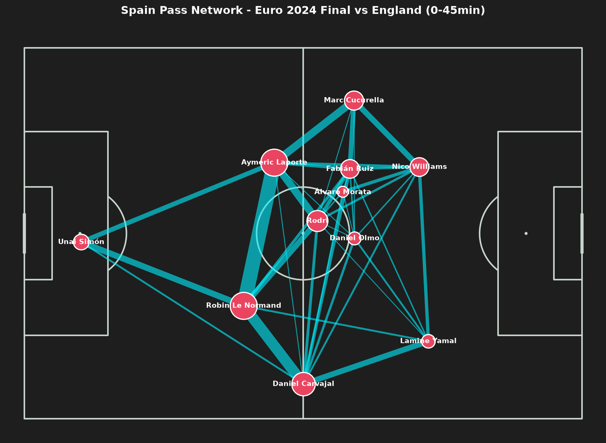

# 2024 유로 결승 스페인 패스 네트워크 (샘플 분석)

`ideas/backlog.md`의 "2024 유로 스페인의 빌드업 패턴" 항목에 대한 샘플 분석입니다. 전체 7경기 분석 전, 방법론을 검증하고 읽는 법을 정리하기 위해 결승전(vs 잉글랜드) 전반 45분(첫 교체 전)만 먼저 살펴봤습니다.

- 경기: 2024-07-14, 결승, Spain 2 : 1 England (match_id 3943043)
- 분석 구간: 0~45분 (스페인 첫 교체 시각 이전, 선발 라인업 고정 구간)
- 도출 방법: `src/visualizer.py`의 `plot_pass_network()` — 성공한 패스만 사용, 선수별 평균 시작 위치를 노드로, 선수 쌍 간 패스 횟수(최소 2회 이상)를 엣지로 표시. 자세한 산출 절차는 `spain_euro2024/pass_network/04_spain_euro2024_buildup.ipynb`의 "방법론" 셀 참고.

## 가장 영향력 있는 선수

노드 크기(패스 시도 횟수)와 상위 연결 개수를 함께 보면:

| 선수 | 패스 시도 | 비고 |
| :--- | ---: | :--- |
| Aymeric Laporte | 48 | 상위 10개 연결 중 4개에 등장 (르노르망·로드리·쿠쿠레야·우나이 시몬) |
| Robin Le Normand | 48 | 상위 10개 연결 중 4개에 등장 (라포르테·카르바할·우나이 시몬·로드리) |
| Daniel Carvajal | 36 | 르 노르망과의 연결이 23회로 2번째로 두꺼운 선 |
| Rodri | 29 | 양쪽 센터백과 각각 16회·12회로 강하게 연결 — 후방 전개 전담형 |

**라포르테와 르 노르망(센터백 듀오)**이 공동 1위로, 단순히 패스량이 가장 많을 뿐 아니라 팀 전체 연결을 잇는 허브 역할까지 겸합니다 — 빌드업의 실질적인 축입니다.

## 대형(포지셔닝) 특징

- **센터백 비대칭 분산**: 라포르테(y≈25)와 르 노르망(y≈56)이 좌우로 넓게 벌려 서고, 로드리(중앙)와 삼각형을 이뤄 1차 전개 구조를 형성.
- **풀백은 사실상 윙어 위치**: 카르바할(x≈60, y≈73)과 쿠쿠레야(y≈11)가 각자 터치라인까지 바짝 붙어 전진 — 특히 카르바할은 니코 윌리엄스보다도 더 넓게 벌어져 윙백처럼 뜀.
- **윙어는 터치라인 유지**: 니코 윌리엄스(왼쪽)·라민 야말(오른쪽)이 안쪽으로 좁히지 않고 각자 측 풀백과 같은 편 폭을 유지.
- **모라타는 얕게 관여**: 패스 시도 8회로 가장 적고, 위치도 로드리·올모와 비슷한 높이 — 최전방 고정보다 연계 가담형.

## 종합

전반전만 보면 스페인은 "센터백 2명이 넓게 벌려 로드리와 삼각 편대를 이루고, 양쪽 풀백이 윙 포지션까지 전진해 폭을 담당, 윙어는 터치라인을 지키며 안쪽 공간을 로드리·파비안·올모가 채우는" 구조로 나타납니다.

## 한계 / 다음 단계

- **한 경기, 전반 45분만의 스냅샷**입니다. 이것이 대회를 관통하는 스타일인지는 7경기 전체를 종합한 [`../RESULTS.md`](../RESULTS.md)에서 확인하세요.
- 평균 위치는 이상치(세트피스 등)에 영향받을 수 있고, 후반전 전술 변화는 반영되지 않습니다.
