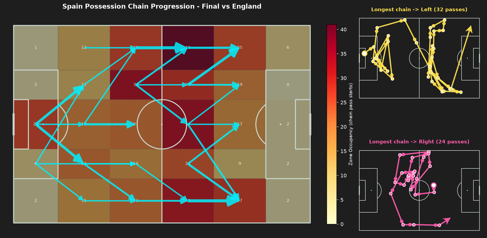

# possession 체인 추적 결과: 2024 유로 스페인 빌드업 패턴

`../PLAN.md`의 분석 질문 6("왼쪽 진출 루트가 실제로 몇 번의 패스·어떤 구역들을 거쳐 이루어지는가")에 대한 종합 결과입니다. 방법론은 [`06_spain_euro2024_possession_chains.ipynb`](./06_spain_euro2024_possession_chains.ipynb)의 "방법론" 셀과 `src/visualizer.py`의 `plot_possession_chain_progression()` 문서를, 7경기 원본 이미지는 [`processed/spain_euro2024_possession_chains/`](./processed/spain_euro2024_possession_chains/)를 참고하세요.

## 왼쪽 진출 체인이 더 길다 (분석 질문 6)

체인(같은 possession 안에서 이어진 성공 패스 2회 이상)을 "마지막 패스가 도착한 구역"의 좌/중/우 채널로 나눠 체인 길이(패스 수)를 비교했습니다.

| 경기 | 왼쪽 체인 수 / 중앙값 패스 수 | 오른쪽 체인 수 / 중앙값 패스 수 | 우세 |
| :--- | ---: | ---: | :--- |
| GS vs Croatia | 27 / **5.0** | 19 / 4.0 | 왼쪽 |
| GS vs Italy | 29 / **7.0** | 20 / 6.0 | 왼쪽 |
| GS vs Albania | 23 / **8.0** | 25 / 6.0 | 왼쪽 |
| R16 vs Georgia | 24 / 11.0 | 20 / **14.5** | 오른쪽 (예외) |
| QF vs Germany | 27 / **5.0** | 24 / 4.5 | 왼쪽(근소) |
| SF vs France | 25 / **6.0** | 22 / 4.5 | 왼쪽 |
| Final vs England | 15 / **8.0** | 27 / 6.0 | 왼쪽 |

**7경기 중 6경기에서 왼쪽으로 끝난 체인의 중앙값 패스 수가 오른쪽보다 많았습니다.** 왼쪽/오른쪽 체인의 "개수"(표본)는 경기마다 어느 쪽이 더 많을지 뒤섞여 있어 뚜렷한 편향이 없는 반면, "길이"는 왼쪽이 꾸준히 깁니다. 이는 [`../zone_progression/RESULTS.md`](../zone_progression/RESULTS.md)에서 확인한 "`Att-Mid/Left Wide` 구역 점유가 7경기 내내 상위권"이라는 결과를, "그냥 왼쪽으로 많이 보낸다"가 아니라 **"왼쪽으로 나가는 전개는 더 많은 패스를 거쳐 정교하게 조립된다"**는 방향으로 한 단계 더 구체화합니다. 오른쪽으로 향하는 체인은 상대적으로 짧고 직선적인 반면, 왼쪽으로 향하는 체인은 중앙에서 여러 차례 순환하다가 하프스페이스를 거쳐 도달하는 경우가 많았습니다(대표 체인 미니 패널 참고, 예: 결승전 왼쪽 대표 체인 32패스 vs 오른쪽 24패스).

## 예외: R16 조지아전

유일하게 오른쪽 체인의 중앙값(14.5)이 왼쪽(11.0)보다 긴 경기입니다. 대표 체인 미니 패널을 보면 원인이 드러납니다 - 오른쪽으로 끝난 "가장 긴 체인"이 51패스짜리 특이 사례로, 공격 3분의 1 오른쪽 구역에서 매우 촘촘하게 순환한 뒤 끝났습니다. 조지아전은 스페인이 4-1로 압도한 경기라 전체 표본 자체가 컸고(possession당 스페인 성공 패스 최댓값 51 - `.claude/rules/statsbomb-data-notes.md` 데이터 검토 결과와 일치), 그 안에서 오른쪽 채널의 단일 순환이 유난히 길게 이어진 것이 중앙값을 끌어올렸습니다. 즉 이 예외는 "이 경기만 오른쪽이 주 루트였다"기보다, 표본이 큰 경기에서 나타난 특이 체인 하나의 영향으로 해석하는 편이 정확합니다.

## 대표 체인으로 본 왼쪽 경로의 형태

왼쪽/오른쪽 각 경기에서 가장 긴 체인 하나씩을 실제 좌표 그대로 이어보면(오른쪽 미니 패널), 왼쪽 체인은 공통적으로 후방/중앙에서 짧은 패스를 여러 차례 주고받으며 위치를 재조정한 뒤 왼쪽 하프스페이스·와이드로 빠져나가는 모양을 보였습니다. 이는 패스 네트워크 결과([`../pass_network/RESULTS.md`](../pass_network/RESULTS.md))의 "로드리 축 중앙 순환"이 왼쪽 전개의 실제 "조립 과정"으로 이어진다는 정성적 관찰을, 개별 체인 단위에서 확인해 줍니다.

## 한계 / 유의사항

- 대표 체인은 "가장 긴 체인"(패스 수 최다) 1개를 뽑은 것으로, 그 경기의 "가장 전형적인" 왼쪽/오른쪽 진출 경로를 의미하지는 않습니다 - 실제로 왔다갔다하는 패스가 많이 섞인 체인일수록 길어지므로, 표본 하나로 일반화하기보다는 "이런 형태의 체인이 존재했다"는 구체적 사례로 읽어야 합니다.
- 체인 분류는 "마지막 패스가 도착한 구역"만 기준으로 하므로, 체인 중간에 왼쪽·오른쪽을 오가다가 우연히 중앙/반대쪽에서 끝난 경우 그 체인의 실질적인 방향성(예: 대부분 왼쪽에서 전개되다 마지막 한 번만 오른쪽으로 빠짐)은 반영되지 않습니다.
- `min_chain_length=2`로 체인을 정의했으므로, 패스 없이 소유권만 짧게 가진 possession(전 경기에서 다수 존재 - 데이터 검토 결과 최솟값 1)은 분석에서 제외됩니다.
- 이 문서는 possession 체인 추적 관점의 결론만 다룹니다. 패스 네트워크·구역 기반 전진 경로와 종합한 최종 "스페인 빌드업 스타일" 결론은 상위 [`../PLAN.md`](../PLAN.md)/[`../RESULTS.md`](../RESULTS.md)를 참고하세요.
