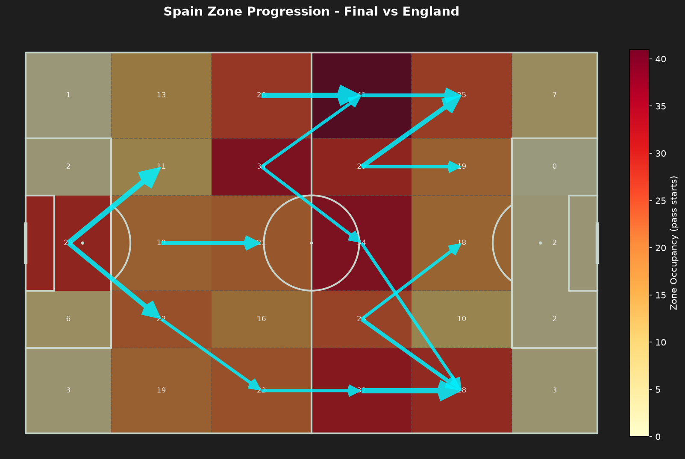

# 구역 기반 전진 경로 결과: 2024 유로 스페인 빌드업 패턴

`../PLAN.md`의 분석 질문에 대한 구역 기반 전진 경로 부분의 종합 결과입니다. 방법론은 [`05_spain_euro2024_zone_progression.ipynb`](./05_spain_euro2024_zone_progression.ipynb)의 "방법론" 셀과 `src/visualizer.py`의 `plot_zone_progression()` 문서를, 7경기 원본 이미지는 [`processed/spain_euro2024_zone_progression/`](./processed/spain_euro2024_zone_progression/)를 참고하세요.

## 대회 전체를 관통하는 패턴 (분석 질문 1, 4)

7경기의 점유 히트맵 상위 구역을 뽑아보면 아래와 같습니다(구역 = "가로단/세로채널", 숫자는 그 구역에서 시작된 성공 패스 수).

| 경기 | 1위 구역 | 2위 구역 | 3위 구역 |
| :--- | :--- | :--- | :--- |
| GS vs Croatia | Def-Mid/Central = 40 | **Att-Mid/Left Wide = 40** | Def Box/Central = 27 |
| GS vs Italy | Att Third/Left Wide = 45 | Att-Mid/Central = 44 | **Att-Mid/Left Wide = 41** |
| GS vs Albania | Att-Mid/Central = 44 | Def-Mid/Central = 43 | **Att-Mid/Left Wide = 40** |
| R16 vs Georgia | Att Third/Left Wide = 95 | **Att-Mid/Left Wide = 86** | Att Third/Right Wide = 57 |
| QF vs Germany | Def-Mid/Central = 40 | **Att-Mid/Left Wide = 36** | Att Third/Left Wide = 36 |
| SF vs France | **Att-Mid/Left Wide = 67** | Att-Mid/Central = 32 | Att Third/Left Wide = 32 |
| Final vs England | **Att-Mid/Left Wide = 41** | Att-Mid/Central = 34 | Def-Mid/Left HS = 34 |

**`Att-Mid/Left Wide`(하프라인을 갓 넘긴 왼쪽 와이드 구역)가 7경기 전부에서 상위 3위 안에 들었고, 4경기(프랑스·독일·결승·조지아)에서는 1~2위를 차지했습니다.** 이는 왼쪽 측면(니코 윌리엄스가 주로 뛴 자리)으로 볼을 진출시키는 루트가 상대·경기 중요도와 무관하게 스페인 빌드업의 가장 일관된 목적지였다는 뜻입니다. 화살표 다이어그램에서도 거의 모든 경기에서 같은 모양의 동선이 반복됩니다 - 중앙(Def-Mid/Central)에서 시작해 대각선으로 한 번 꺾어 하프스페이스를 거친 뒤, 다시 대각선으로 꺾어 `Att-Mid/Left Wide`로 모이는 "Z자형" 경로입니다.

동시에 `Def-Mid/Central`·`Att-Mid/Central`(하프라인을 낀 중앙 구역)도 대부분의 경기에서 상위 3위 안에 들어, 로드리 축을 통한 중앙 순환이 왼쪽 전개의 "출발점" 역할을 한다는 패스 네트워크 결과([`../pass_network/RESULTS.md`](../pass_network/RESULTS.md))와 일치하는 그림을 보여줍니다.

## 경기별 메모 (분석 질문 2)

| 경기 | 특이사항 |
| :--- | :--- |
| GS vs Croatia | 중앙(Def-Mid/Central)과 왼쪽(Att-Mid/Left Wide)이 40으로 동률 1위 - 아직 어느 한쪽에 치우치지 않은, 대회 초반의 "균형 잡힌" 버전. |
| GS vs Italy | 유일하게 `Att Third`(공격 최종 구역)의 왼쪽 와이드가 1위(45) - 왼쪽 전개가 다른 경기보다 더 깊숙이(박스 근처까지) 이어짐. |
| GS vs Albania | 이미 16강이 확정된 로테이션 경기였음에도(패스 네트워크 분석 참고) 중앙-왼쪽 구조는 그대로 유지. |
| R16 vs Georgia | 전 구역에서 점유 수치가 압도적으로 높음(1위 95, 2위 86) - 7경기 중 전체 성공 패스(782개)·전진 패스(190개)·화살표 수(22개) 모두 최다. 스페인이 사실상 경기를 일방적으로 지배했음을 수치로 보여줌. |
| QF vs Germany (연장) | `Def Box`(자기 페널티박스 라인 안쪽) 왼쪽 구역 점유가 다른 경기보다 높음(30) - 연장까지 가며 후방에서 더 오래 순환한 흔적. 상위권은 여전히 중앙-왼쪽 구조. |
| SF vs France | `Att-Mid/Left Wide`가 67로 단독 압도적 1위(2위와 2배 이상 차이) - 왼쪽 편중이 7경기 중 가장 극단적. 반면 전체 성공 패스(473)·전진 패스(116)는 하위권 - 프랑스의 압박에 순환 자체는 억눌렸지만, 뚫을 때는 거의 항상 왼쪽이었다는 뜻. |
| Final vs England | 중앙(34)보다 왼쪽(41)이 우세 - 7경기 중 유일하게 "중앙 1위"가 아니라 "왼쪽 1위"인 조합이 상위 2개 구역을 지배. 잉글랜드가 중앙을 강하게 압축해 스페인이 더 일찍 왼쪽으로 볼을 뺐을 가능성. |

## 표본 크기에 따른 화살표 개수 차이 (읽을 때 유의사항)

화살표는 "같은 구역 쌍(전진 방향)이 3회 이상 반복돼야" 그려지므로, **경기별 화살표 개수 차이는 시각화 설정이 아니라 그날 스페인이 실제로 얼마나 많이·안정적으로 볼을 돌렸는지를 반영합니다.**

| 경기 | 전체 성공 패스 | 전진 패스 | 화살표 수(3회 이상 반복된 구역 쌍) |
| :--- | ---: | ---: | ---: |
| GS vs Croatia | **410** (최소) | 104 | **9** (최소) |
| SF vs France | 473 | 116 | 14 |
| QF vs Germany | 512 | 143 | 14 |
| Final vs England | 518 | 127 | 15 |
| GS vs Albania | 549 | 145 | 18 |
| GS vs Italy | 564 | 140 | 17 |
| R16 vs Georgia | **782** (최대) | 190 | **22** (최대) |

크로아티아전(대회 첫 경기)은 전체 성공 패스가 410개로 7경기 중 가장 적었고, 그만큼 같은 구역 쌍이 3회 이상 반복될 기회 자체가 줄어 화살표도 가장 적게(9개) 나왔습니다. 반대로 조지아전은 전체 패스가 782개로 가장 많아 화살표도 가장 많습니다(22개). 즉 **화살표가 적다고 해서 그 경기의 빌드업 "다양성"이 낮았다는 뜻이 아니라, 스페인이 그만큼 볼을 오래 소유하며 안정적으로 돌릴 기회 자체가 적었던 경기(상대 압박이 강했거나 경기 흐름이 빨랐던 경기)라고 해석해야 합니다.**

## 한계

- 화살표는 "성공한 전진 패스" 하나하나를 구역 쌍으로 집계한 것으로, 연속된 빌드업 시퀀스(여러 패스가 이어진 하나의 전개)를 추적하지는 않습니다. 화살표 두 개가 이어져 보여도 같은 공격 전개였는지는 알 수 없습니다.
- 위 "화살표 개수" 비교에서 보듯 경기별 표본 크기(전체 패스 수)가 최대 2배 가까이 차이 나므로, 경기 간 점유 수치를 직접 비교할 때도 이 차이를 감안해야 합니다(예: 조지아전의 절대적으로 큰 숫자는 대부분 "표본이 많아서"이지, 다른 경기보다 왼쪽 편중이 극단적으로 더 심했다는 뜻은 아닙니다 - 상대적 비율로 보면 프랑스전의 왼쪽 편중이 더 두드러집니다).
- 이 문서는 구역 기반 전진 경로 관점의 결론만 다룹니다. 패스 네트워크와 종합한 최종 "스페인 빌드업 스타일" 결론은 상위 [`../PLAN.md`](../PLAN.md)에서 별도로 정리할 예정입니다.
